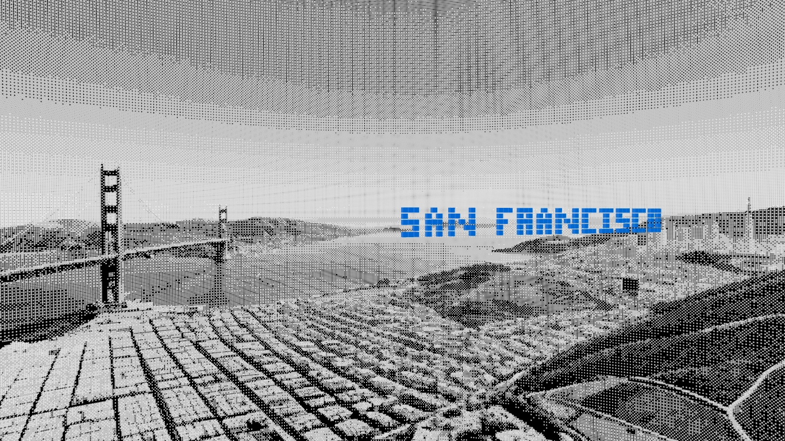

# 🌃 Typespace

Typespace is a creative 3D web experience where the text **"SAN FRANCISCO"** floats inside a cinematic digital space inspired by the city of San Francisco.
The project focuses on motion, atmosphere, and immersive visuals to create a futuristic experience directly in the browser.


## 🧊 Features

- 🌉 San Francisco-inspired 3D environment
- 🔠 Floating cube-based typography
- 🎥 Smooth camera movement and rotation
- 🌌 Immersive city atmosphere
- 📱 Responsive experience across devices


## 🎯 Project Vision

Typespace explores the idea of blending typography with immersive 3D environments to create a futuristic visual experience.
The project aims to make users feel as if floating text exists naturally inside a cinematic digital version of San Francisco, combining motion, atmosphere, and minimal design into an interactive web experience.


## 🛠️ Built With

- Next.js
- TypeScript
- Three.js
- Tailwind CSS


## ⚙️ Installation

Clone the repository:
```bash
git clone https://github.com/sajanbodele/Typespace.git
```

Go to the project folder:
```bash
cd Typespace
```

Install dependencies:
```bash
pnpm install
```

Run the development server:
```bash
pnpm dev
```

## 📸 Preview



## 🌍 Deployment

Deployed using Vercel.
